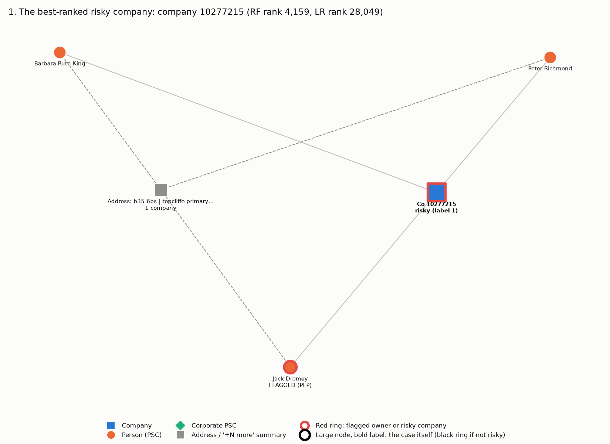
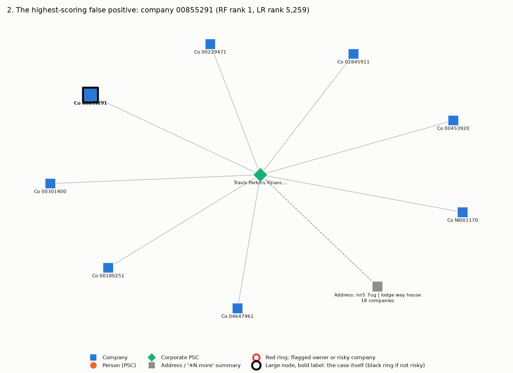
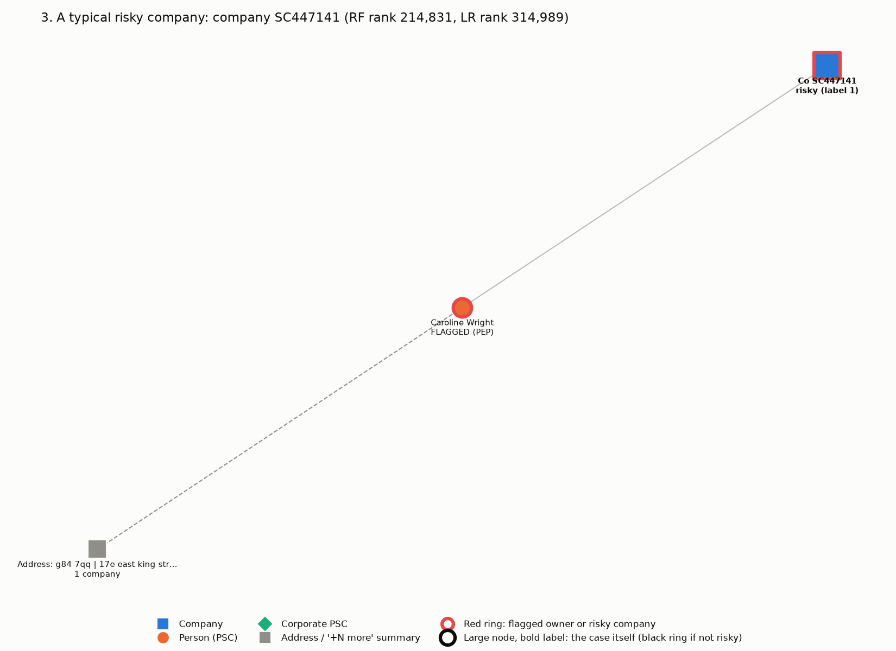
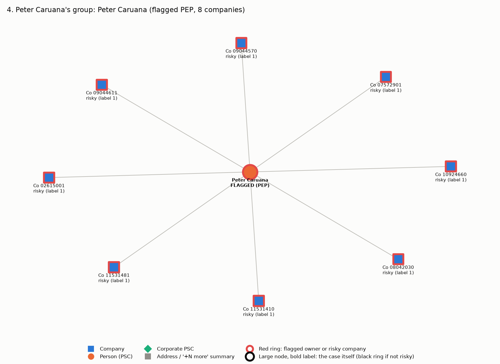
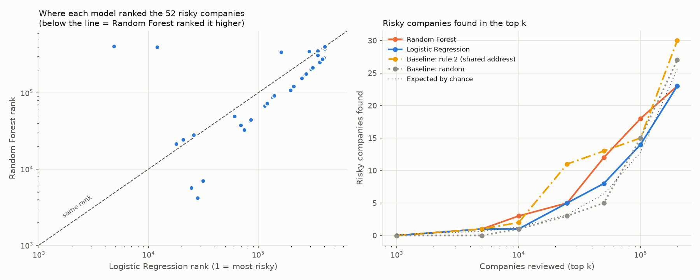

# Case studies (Phase 5)

Generated 2026-10-08 by `src/case_studies.py`. Ranks are out-of-fold (each company scored by a model that never saw it), 1 = most risky, with the same tie-break as Phase 4.

No risky company reached the top 1,000 of any method (Checkpoint 4), so these cases explain **why the models failed** rather than show successes. The key test is the **feature twins** count: how many companies have exactly the same four feature values. A model that only sees these four numbers must give all twins the same score.

Drawings: squares are companies, circles people, diamonds corporate owners; a red ring marks a flagged owner or risky company; grey squares are an address or a '+N more' summary (at most 8 neighbours drawn per node).

## 1. The best-ranked risky company: company 10277215

- This is the risky company that Random Forest ranked highest, yet it is only at **4,159** of 406,715 (Logistic Regression: 28,049). No risky company made the top 1,000.
- Unusual values (top 10%): `degree` = 3, `component_size` = 4.
- **4,917 companies have exactly the same four feature values; 3 of them are risky** (0.061%, about 5x the overall rate of 0.0128%). That small enrichment is why the forest puts this profile in roughly the top 1-2%, but it cannot tell this company apart from the other 4,914 non-risky twins, so it cannot rank higher.

| Feature | Value | Percentile |
|---|---|---|
| `flagged_neighbour_companies` | 0 | higher than 0.0% of companies |
| `shared_address_count` | 0 | higher than 0.0% of companies |
| `degree` | 3 | higher than 97.5% of companies |
| `component_size` | 4 | higher than 93.2% of companies |

| Method | Score | Rank |
|---|---|---|
| Random Forest | 0.6809 | 4,159 of 406,715 |
| Logistic Regression | 0.6393 | 28,049 of 406,715 |
| Rule 2 (shared address) | 0 | 230,795 of 406,715 |
| Random baseline | 0.9107 | 36,299 of 406,715 |

## 2. The highest-scoring false positive: company 00855291

- Random Forest's single highest score belongs to a company that is **not risky** (Logistic Regression ranks it 5,259). Its owner: Travis Perkins Financing Company No.3 Limited (controls 8 companies).
- Unusual values (top 10%): `shared_address_count` = 17, `component_size` = 9. Hub component: no.
- **16 companies share its exact feature profile and 8 of them are risky**, all owned by: Peter Caruana (8). The non-risky twins take Random Forest ranks 1, 2, 3, 4, 5, 6, 7, 8.
- When this company was scored, the training folds held 8 companies with this exact profile and **8 of them were risky**. So the forest learned 'this exact profile = risky' from one flagged owner's group of companies, and applied it to an unrelated corporate group that happens to have the same shape. This is memorising one group, not a general pattern.

| Feature | Value | Percentile |
|---|---|---|
| `flagged_neighbour_companies` | 0 | higher than 0.0% of companies |
| `shared_address_count` | 17 | higher than 93.7% of companies |
| `degree` | 1 | higher than 0.0% of companies |
| `component_size` | 9 | higher than 98.6% of companies |

| Method | Score | Rank |
|---|---|---|
| Random Forest | 0.9867 | 1 of 406,715 |
| Logistic Regression | 0.7932 | 5,259 of 406,715 |
| Rule 2 (shared address) | 17 | 24,262 of 406,715 |
| Random baseline | 0.3288 | 272,844 of 406,715 |

## 3. A typical risky company: company SC447141

- Its Random Forest rank, 214,831, is the closest to the median rank of all risky companies (217,185).
- Unusual values (top 10%): none of its four values is unusual.
- **229,197 companies have exactly the same four feature values; 22 are risky** (rate 0.0096% vs 0.0128% overall). This is the most common profile of all (56% of companies: one owner, a two-node component, no shared address). On these four features it is indistinguishable from an ordinary company, so it lands mid-table.

| Feature | Value | Percentile |
|---|---|---|
| `flagged_neighbour_companies` | 0 | higher than 0.0% of companies |
| `shared_address_count` | 0 | higher than 0.0% of companies |
| `degree` | 1 | higher than 0.0% of companies |
| `component_size` | 2 | higher than 0.0% of companies |

| Method | Score | Rank |
|---|---|---|
| Random Forest | 0.4023 | 214,831 of 406,715 |
| Logistic Regression | 0.3925 | 314,989 of 406,715 |
| Rule 2 (shared address) | 0 | 243,575 of 406,715 |
| Random baseline | 0.1645 | 339,801 of 406,715 |

## 4. Peter Caruana's group

- Peter Caruana is the only flagged owner who controls more than one company: **8 companies**, all labelled risky.
- **His own companies all have `flagged_neighbour_companies` = 0**, by design: he is flagged, so he is removed before counting neighbours (otherwise the feature would contain the label).
- His companies have no owner other than him. Once he is removed, there is nothing left to link through.
- Feature 1 is non-zero for only **7 companies** in the whole dataset, none of them risky, and **0 of them** are linked to his group. So feature 1 does NOT fire around Caruana at all; every non-zero value comes from a different risky company:

| Company | Feature 1 | Linked to (risky company) | How |
|---|---|---|---|
| 03734233 | 1 | 12203520 | shared owner Haim Judah Michael Levy + shared address '57/63, line wall road, gibraltar, gibraltar' |
| 04138637 | 1 | 08840064 | shared address 'wc2e 9ab | 17 slingsby place' |
| 04651294 | 1 | 05716547 | shared owner Alexey Mordashov + shared address '2, klara tsetkin, moscow, 127299, russia' |
| 08760550 | 1 | 12203520 | shared address '57/63, line wall road, gibraltar, gibraltar' |
| 09075560 | 1 | 12203520 | shared owner Haim Judah Michael Levy + shared address '57/63, line wall road, gibraltar, gibraltar' |
| 11531543 | 1 | 12203520 | shared owner Haim Judah Michael Levy + shared address '57/63, line wall road, gibraltar, gibraltar' |
| 11663902 | 1 | 13550810 | shared address 'bn1 2lb | 90 basement floor' |

| Caruana company | Label | Feature 1 | RF rank | LR rank |
|---|---|---|---|---|
| 02615001 | 1 | 0 | 382,163 | 405,607 |
| 07572901 | 1 | 0 | 382,037 | 405,604 |
| 08042030 | 1 | 0 | 382,495 | 405,610 |
| 09044570 | 1 | 0 | 382,097 | 405,606 |
| 09044611 | 1 | 0 | 382,228 | 405,608 |
| 10924660 | 1 | 0 | 382,265 | 405,609 |
| 11531410 | 1 | 0 | 382,086 | 405,605 |
| 11531481 | 1 | 0 | 381,945 | 405,603 |

- **Why his companies rank near the bottom** (Random Forest ~382,000, Logistic Regression ~405,600 of 406,715): all 8 are in the same split group, so they always share a test fold. When they were scored, the training folds held 8 companies with their exact profile and 0 of them were risky (the twins of case 2). The model had learned 'this profile = not risky', the mirror image of case 2. The grouped split did its job: his companies could not vouch for each other.
- Their only risky twins are owned by: Peter Caruana (8), i.e. themselves; nobody else in the data has this profile and is risky.
- So the feature designed to capture 'risk spreads through the network' can only fire on *neighbours* of a risky company through a non-flagged owner or a not-too-busy address, and in this 1-of-32 sample there are just 7 such neighbours, none of them risky themselves.

## 5. Random Forest vs Logistic Regression

| | Logistic Regression | Random Forest |
|---|---|---|
| PR-AUC (mean ± std over folds) | 0.00019 ± 0.00007 | 0.00020 ± 0.00005 |
| ROC-AUC | 0.513 | 0.540 |
| Accuracy at 0.5 (context only) | 0.762 | 0.906 |
| Median rank of the risky companies | 264,671 | 217,185 |
| Risky companies it ranked higher than the other model did | 9 | 43 |

Risky companies found in the top k (pooled out-of-fold scores):

| k | 1,000 | 5,000 | 10,000 | 25,000 | 50,000 | 100,000 | 200,000 |
|---|---|---|---|---|---|---|---|
| Random Forest | 0 | 1 | 3 | 5 | 12 | 18 | 23 |
| Logistic Regression | 0 | 1 | 1 | 5 | 8 | 14 | 23 |
| Baseline: rule 2 (shared address) | 0 | 1 | 2 | 11 | 13 | 15 | 30 |
| Baseline: random | 0 | 0 | 1 | 3 | 5 | 15 | 27 |
| Expected by chance | 0.1 | 0.6 | 1.3 | 3.2 | 6.4 | 12.8 | 25.6 |

- **The two models agree only weakly:** Spearman rank correlation of their scores across all 406,715 companies is 0.25, and no company is in both top-1,000 lists.
- **Biggest disagreement on a risky company:** 09132366 — Logistic Regression rank 4,848, Random Forest rank 406,668.
- **Why they differ:** Logistic Regression can only move a score smoothly up or down along each feature, so similar companies get similar scores. Random Forest scores small groups of companies with near-identical values by how many training positives they held. With ~40 positives per training fold that lets it memorise exact profiles (cases 2 and 4 are the two sides of one memorised profile). It ranks 43 of the 52 risky companies higher than Logistic Regression does, without either being useful.
- **Neither model is useful at a realistic review size:** in the top 1,000 neither finds a single risky company. Further down, Random Forest finds 12 by k = 50,000 and Logistic Regression 8, against 6.4 expected by chance and 13 for the simple shared-address rule. These are small counts from 52 positives, so the differences are not reliable, and neither model beats the baselines (Checkpoint 4).
