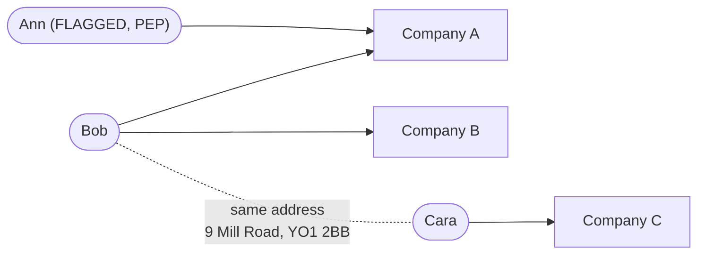

# Methodology: graph construction and feature engineering

This explains, in plain language, how the project turns a list of company
owners into a network and then into four numbers per company. The code is
in `src/graph_builder.py` (the graph) and `src/features.py` (the features);
the choices behind each step, with evidence, are in
[design_decisions.md](design_decisions.md).

## 1. Starting point: owner records

Companies House publishes, for every UK company, its **persons with
significant control (PSCs)**: the people or companies that own or control
it. Each record says *who* (a name), *which company* (a company number),
*where* (a correspondence address) and *how* (e.g. "owns 75-100% of the
shares"). We use one of the 32 snapshot files: 499,971 records about
406,715 companies.

Separately, each owner has been matched against the PEP and sanctions lists
(Phase 1). A **strong** match (name similar enough *and* the same birth
month and year) makes that owner **flagged**.

## 2. Building the graph

A graph is a set of **nodes** (things) joined by **edges** (relationships).

**Nodes.** There are three kinds:

| Node | One per | Identified by |
|---|---|---|
| Company | company number | `company:<number>` |
| Person (individual owner) | distinct person | name + postcode, e.g. `person:bob david lee\|YO1 2BB` |
| Corporate owner | owning company or legal body | its name |

The person identity is the important choice. The register has no personal
ID, so the same person controlling three companies appears in three
separate records. Joining records with the **same name at the same
postcode** turns them into one node, which is how we see that one person
controls several companies (8,627 people do). Using the postcode, not just
the name, stops every "John Smith" in the country collapsing into one fake
super-owner.

**Edges.** One edge from each owner to each company it controls, labelled
with the type of control. If the same owner is listed twice for the same
company, the two records become one edge.

**Flags.** Owners with a strong list match are marked `flagged` (PEP,
sanctions, or both).

**Address keys.** Each owner record also gets an **address key**: the
postcode plus the first line of the address, lowercased (e.g.
`yo1 2bb | 9 mill road`). Addresses are *not* nodes; they are only used to
spot companies whose owners share an address. Addresses used by more than
50 companies (virtual offices, formation agents, accountants) are ignored,
because sharing one says nothing about a real connection.

**Connected groups.** Following edges in either direction, companies and
owners that are linked, even indirectly, form a **connected component**.
Most components are tiny: 79% are one company and one owner.

## 3. The label

A company is **risky (`label = 1`)** if at least one of its *direct* owners
is flagged. That gives 52 risky companies out of 406,715.

## 4. The four features

For every company we compute four numbers. Together with the label, they
are what the models learn from.

1. **`flagged_neighbour_companies`**: how many *other* risky companies are
   connected to this one through an owner who is **not flagged** (a shared
   co-owner), or through owners sharing an address key.
   **Leakage guard:** flagged owners are removed before counting, on both
   sides. The obvious version, "does it have a flagged owner next to it?",
   *is* the label, so the model would be handed the answer. With the guard,
   a risky company never gets credit for its own flagged owner.
2. **`shared_address_count`**: how many *other* companies have at least one
   owner at the same (not overcrowded) address.
3. **`degree`**: how many owners the company has.
4. **`component_size`**: how many nodes (companies + owners) are in its
   connected group.

Two extra columns are kept for analysis but **not** given to the models:
`shortest_distance_to_flagged` (hops to the nearest flagged owner, again
ignoring the company's own flagged owners; -1 if none can be reached) and
`split_group_id` (connected group merged with address-sharing companies,
used to keep linked companies together when splitting data into training
and test sets).

## 5. Worked example

Three companies, three people. This example was run through the real code
(`build_graph` and `compute_features`) to check every number.

| Owner | Owns | Address | Flagged? |
|---|---|---|---|
| Ann Clare Hart | Company A | 1 Rose Lane, Leeds, LS1 1AA | **yes (PEP)** |
| Bob David Lee | Companies A and B | 9 Mill Road, York, YO1 2BB | no |
| Cara Joan Moss | Company C | 9 Mill Road, York, YO1 2BB | no |

The graph has 6 nodes (3 companies, 3 people) and 4 edges. Bob owns two
companies, so A, B, Ann and Bob form one connected group; C and Cara form
another. The dotted line is *not* an edge: it only marks that Bob and Cara
share an address key.

| | Company A | Company B | Company C |
|---|---|---|---|
| **label** | **1** (Ann is flagged) | 0 | 0 |
| `degree` | 2 (Ann, Bob) | 1 (Bob) | 1 (Cara) |
| `component_size` | 4 (A, B, Ann, Bob) | 4 | 2 (C, Cara) |
| `shared_address_count` | 2 (B and C use 9 Mill Road) | 2 (A and C) | 2 (A and B) |
| `flagged_neighbour_companies` | **0** | 1 (A, via co-owner Bob) | 1 (A, via the shared address) |
| (plan's version: owner links only) | 0 | 1 | 0 |
| `shortest_distance_to_flagged` | **-1** | 3 (B -> Bob -> A -> Ann) | -1 |
| `split_group_id` | same group | same group | same group |

What the example shows:

- **The leakage guard works.** A is risky because of Ann, yet its
  `flagged_neighbour_companies` is **0** and its distance is **-1**: Ann is
  removed when A's own features are computed, so A's features do not
  contain its label.
- **Risk "spreads" only to neighbours.** B gets 1 because it shares a
  non-flagged co-owner (Bob) with risky A; C gets 1 only because Cara
  shares Bob's address. The plan's original owner-only version gives C 0.
- **The split keeps linked companies together.** C is in a different
  connected group from A and B, but it shares an address with them, so all
  three get the same `split_group_id` and always land in the same
  cross-validation fold.

## 6. Why this did not work on the real data

On the real sample, risky companies almost never have the neighbours that
features 1 and `shortest_distance_to_flagged` look for: feature 1 is
non-zero for 7 companies (none risky) and every risky company has distance
-1. And 56% of all companies share one identical feature profile (one
owner, a two-node group, no shared address). The details are in
[case_studies.md](case_studies.md) and [limitations.md](limitations.md).
